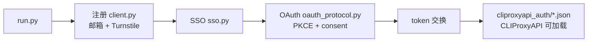

> **简体中文** | [English](README.en.md)

# grok-build-auth

面向 **x.ai / Grok 公开 Web 认证链路** 的协议研究客户端：用纯 HTTP 复现  
`注册 → SSO → OAuth PKCE（Grok Build / CLI scope）→ 导出本地 auth JSON`  
整条链路，便于协议分析、互操作性研究与本地集成测试。

默认路径不依赖浏览器。Turnstile 通过兼容 createTask 协议的打码服务完成。

[](LICENSE)
[](https://www.python.org/)
[](#法律边界)

---

> [!CAUTION]
> **使用本项目即视为同意 [`NOTICE`](NOTICE) 的全部条款。**  
> 项目按 **AS IS** 提供、无任何担保、维护者不负任何责任。  
> **仅限**：你拥有的系统 / 合法 CTF / 授权 bug bounty in-scope 资产 / 安全研究与教学。  
> **严禁**：欺诈、批量造号转售、黑产代注册、未授权目标、故意违反第三方 ToS。  
> 一切法律责任由使用者自负。不接受条款就**不要使用、不要 clone、删除全部副本**。

---

## 法律边界

| | 说明 |
|---|---|
| **允许** | 自有账号与本地环境；明确授权范围内的安全研究；CTF / 课堂 / 学术协议研究；离线阅读源码 |
| **禁止** | 欺诈滥用、批量造号转售、代注册牟利、未授权自动化攻击、规避平台安全机制用于非法目的 |
| **责任** | 账号封禁、额度损失、民事 / 刑事 / 行政责任等全部由**使用者**承担 |
| **关系** | 与 xAI、Grok、Cloudflare、CLIProxyAPI、任何打码 / 邮箱服务商**无隶属、无授权、无赞助** |

完整条款见 [`NOTICE`](NOTICE)。License 是 [MIT](LICENSE)，但 **MIT 不是免责的全部**。

不确定是否合法 —— **不要运行**。先问律师，或先联系目标平台安全团队。

---

## 这是什么

研究型协议客户端，不是官方 SDK。主要能力：

| 阶段 | 内容 |
|---|---|
| **注册** | `accounts.x.ai` 邮箱验证码（gRPC-web）+ Turnstile + Next.js Server Action 建号 |
| **SSO** | 从建号响应 / set-cookie 链提取 session JWT，供 OAuth 复用 |
| **OAuth** | `auth.x.ai` PKCE + CookieSetter + consent；失败时再走 CreateSession |
| **导出** | 写出与 [CLIProxyAPI](https://github.com/router-for-me/CLIProxyAPI) 兼容的本地 `type=xai` auth 文件（Grok Build 通道） |

值得看的点：

- **协议优先**：默认纯 HTTP（`curl_cffi` 指纹会话），不启浏览器
- **SSO 复用**：注册 session 可跳过 OAuth 二次打码（快路径）
- **互操作导出**：`cli-chat-proxy.grok.com` + grok-cli headers，**不是** `api.x.ai` 计费 API 密钥通道
- **并发注册**：注册可多线程；OAuth 默认串行，降低会话冲突

---

## 架构



SSO **不能**单独变成 CPA auth 文件；必须完成 OAuth 拿到 `access_token` / `refresh_token` 后才能导出。

---

## 现状与门槛

这不是「零配置即用」的产品。至少需要：

- Python 3.9+
- YesCaptcha（或兼容 createTask 协议）的 API key，用于 Turnstile
- 临时邮箱：Tempmail.lol API key，**或**你自建的 Cloudflare D1 别名邮箱
- （可选）HTTP(S) 代理
- （可选）本地已安装的 CLIProxyAPI，用于加载导出的 auth 目录

平台条款、风控、接口变更会导致链路随时失效；维护者**无义务**持续适配。

---

## 上手

### 安装

```bash
git clone https://github.com/<you>/grok-build-auth.git
cd grok-build-auth
python -m venv .venv

# Windows
.venv\Scripts\activate
# macOS / Linux
# source .venv/bin/activate

pip install -r requirements.txt
cp .env.example .env
# 编辑 .env：只填你自己的密钥，切勿提交 .env
```

### 配置

| 变量 | 必须 | 说明 |
|---|---|---|
| `YESCAPTCHA_API_KEY` | 是 | Turnstile 打码 |
| `TEMPMAIL_API_KEY` | `-e tempmail` 时 | 临时邮箱 |
| `CLOUDFLARE_API_TOKEN` | `-e cloudflare` 时 | CF API token |
| `CLOUDFLARE_ACCOUNT_ID` | 同上 | CF 账户 |
| `CLOUDFLARE_D1_DB_ID` | 同上 | D1 库 ID |
| `ALIAS_MAIL_DOMAINS` | 同上 | 你控制的邮箱域名（逗号分隔） |
| `CLIPROXYAPI_AUTH_DIR` | 否 | 默认 `./cliproxyapi_auth` |
| `HTTPS_PROXY` / `HTTP_PROXY` | 否 | 代理 |

**永远不要**把 `.env`、token 目录提交进 Git。详见 [`SECURITY.md`](SECURITY.md)。

### 运行（研究 / 自有账号场景）

```bash
# 单次完整链路：注册 + SSO + OAuth + 导出
python run.py -n 1

# 并发注册（OAuth 仍串行）
python run.py -n 5 -t 3

# 自建 Cloudflare 邮箱后端
python run.py -n 1 -e cloudflare

# 仅注册 + SSO（不导出 CPA auth）
python run.py -n 1 --no-oauth

# 指定 CLIProxyAPI auth 目录
python run.py -n 1 --cliproxyapi-auth-dir /path/to/CLIProxyAPI/data/auth

# 协议 OAuth 调试日志
python run.py -n 1 --oauth-debug
```

### 辅助脚本

```bash
# 已有账号：单独走 OAuth
python xai_oauth_login.py

# 把 oauth_output 记录导出为 CPA auth
python xai_oauth_export_cliproxyapi.py --cliproxyapi-auth-dir ./cliproxyapi_auth

# 探测 Build 用量信号（不打印完整 token）
python xai_build_quota_probe.py --auth-dir ./cliproxyapi_auth
```

### 导出文件形态（本地文件，非官方密钥）

```json
{
  "type": "xai",
  "auth_kind": "oauth",
  "access_token": "...",
  "refresh_token": "...",
  "base_url": "https://cli-chat-proxy.grok.com/v1",
  "headers": {
    "X-XAI-Token-Auth": "xai-grok-cli",
    "x-grok-client-version": "0.2.93",
    "x-grok-client-identifier": "grok-shell"
  }
}
```

将 CLIProxyAPI 的 `auth-dir` 指向该目录后按 CPA 文档热加载即可（仅限合法自用场景）。

---

## 协议概要

**注册**

1. Warm-up + 动态抓取 Next.js action  
2. 邮箱验证码（gRPC-web）  
3. Turnstile  
4. 建号 + 提取 SSO  

**Build OAuth**

1. PKCE authorize  
2. 有 SSO：CookieSetter + consent（通常无需二次打码）  
3. 无 SSO：Turnstile + CreateSession，再 consent  
4. code → token → 写本地 auth JSON  

接口与额度策略以平台实时行为为准，文档数值仅供研究参考。

---

## 目录结构

```text
.
├── NOTICE                         # 具有约束力的使用须知（必读）
├── LICENSE                        # MIT
├── README.md / README.en.md
├── SECURITY.md
├── run.py                         # 主入口
├── xai_oauth_login.py
├── xai_oauth_export_cliproxyapi.py
├── xai_build_quota_probe.py
├── requirements.txt
├── .env.example
├── xconsole_client/               # 协议库（Python 包名，历史命名）
│   ├── client.py                  # 注册
│   ├── oauth_protocol.py          # 纯协议 OAuth
│   ├── xai_oauth.py               # PKCE / 导出 / 回退
│   └── sso.py / solver.py / ...
└── alias_mail/                    # 可选：Cloudflare 邮箱助手
```


运行产物（已 gitignore）：`sso_output/`、`oauth_output/`、`accounts_output/`、`cliproxyapi_auth/`。

---

## 已知限制

- 依赖第三方公开接口，**随时可能因部署变更而失效**
- Turnstile / 邮箱服务稳定性影响成功率与耗时
- 并发过高可能触发平台风控；研究用途请保持克制
- SSO alone ≠ CPA auth；必须完成 OAuth
- Playwright 回退为可选依赖，默认协议路径不需要

---

## 贡献

欢迎在**合法研究与授权场景**下贡献：

1. 协议变更后的适配（附抓包对比 / 复现步骤）
2. 文档与翻译完善
3. 测试与健壮性（超时、重试、错误分类）
4. 脱敏后的研究笔记（禁止提交真实 token / 邮箱 / cookie）

**不接受**意图用于未授权滥用、批量黑产、绕过平台安全策略的 PR / Issue。

安全问题请走私密渠道，见 [`SECURITY.md`](SECURITY.md)。

---

## 社区

| 渠道 | 用途 |
|---|---|
| [**LINUX DO**](https://linux.do/) | 技术讨论、协议研究反馈、长期记录 |
| QQ 群 **`1058789350`** | 中文圈实时交流 |
| GitHub Issues | bug 报告与 PR（主入口） |

---

## 致谢

- [curl_cffi](https://github.com/lexiforest/curl_cffi) — TLS / HTTP2 指纹会话  
- 相关公开 Web 标准：OAuth 2.0、PKCE、gRPC-web  

---

## 免责声明

> [!IMPORTANT]
> **使用本项目即视为你已完整阅读、完全理解、并明确接受 [`NOTICE`](NOTICE) 的全部条款。**  
> 不能接受 —— 不要使用本项目，删除所有副本。

**摘要（完整文本以 NOTICE 为准）：**

1. **AS IS**：无适销性、特定用途、持续兼容等任何担保。  
2. **仅限授权范围**：自有系统 / 合法 CTF / 授权研究；禁止欺诈、批量转售、未授权目标。  
3. **责任自负**：含账号封禁、民事 / 刑事 / 行政责任、第三方索赔等。  
4. **维护者无义务**回复 issue、修 bug、做协议适配或提供支持。  
5. **无隶属关系**：不代表 xAI、Grok、Cloudflare、CLIProxyAPI 或任何提及的第三方。  

License：[MIT](LICENSE) · 使用须知：[NOTICE](NOTICE) · 安全：[SECURITY.md](SECURITY.md)
